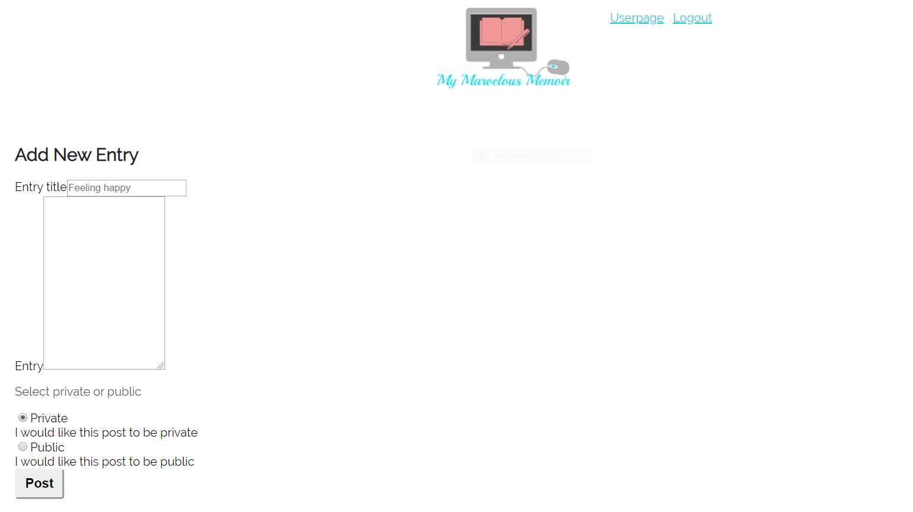
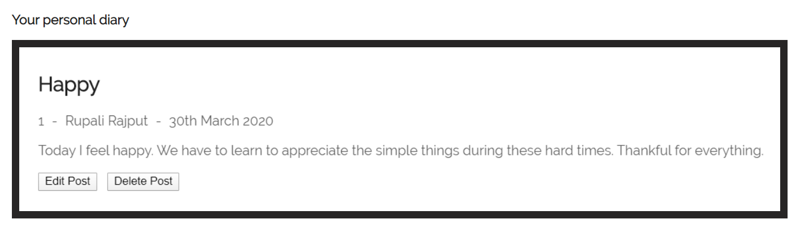

# My Marvelous Memoir

An online personal diary app that allows you to create daily posts which you can edit and delete at anytime.

## Motivation

<!-- We wanted a website that can easily serve our favorite songs to sing and shout while also learning more about the song without having to open a boring Wikipedia page. -->

## Recommended Usage

**For testing purposes, we recommend you test our web app with the Username: Demouser and Password: Demo1234!**

## Screenshots

<!-- Landing Page:

 -->

Add New Entry:

Post Example:

## Built With

- HTML5
- CSS3
- Javascript
- jQuery
- React
- Express
- Node
- JWT

## Demo

- [Live Demo](https://mymarvelousmemoir.now.sh/)

## Author

- **Rupali Rajput** - Front-End development/Back-End development/Styling
